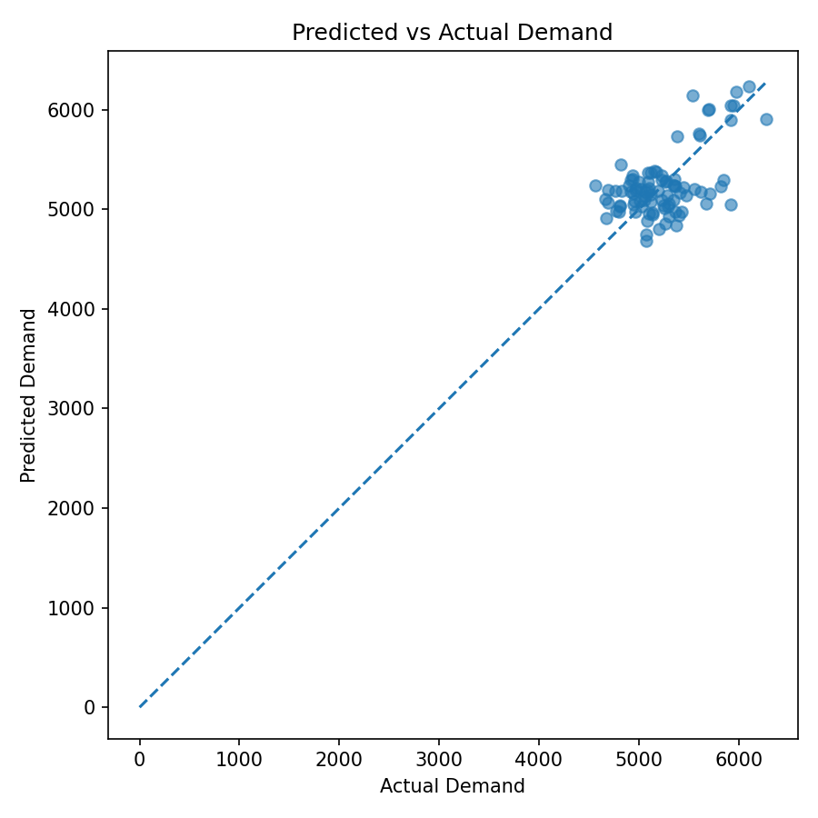
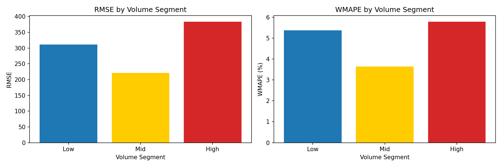
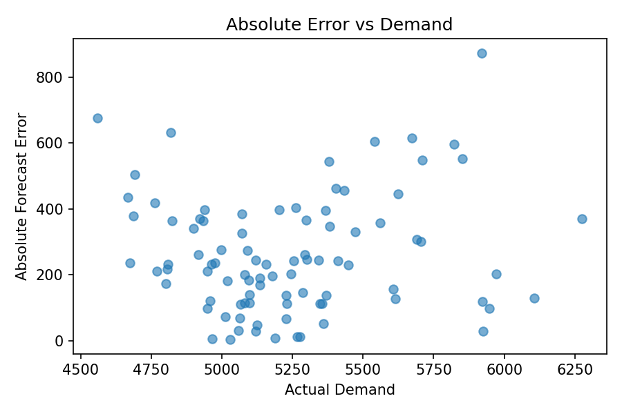
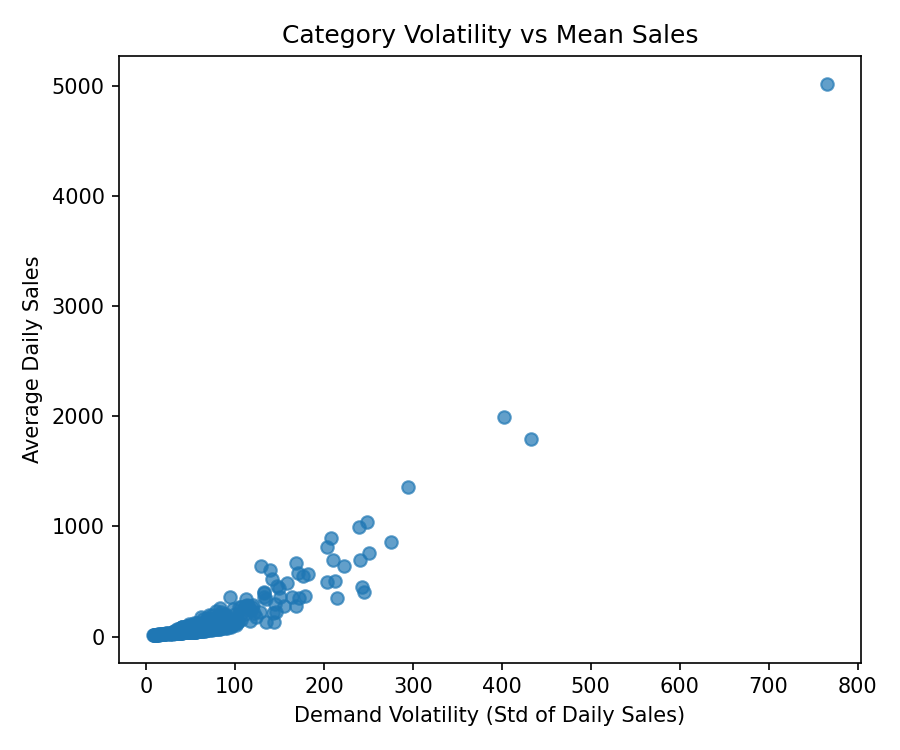

# 📦 Retail Demand Forecasting  
### Reducing Inventory Risk with Machine Learning

Forecasting retail demand is critical for inventory planning.  
This project develops a **machine learning–based demand forecasting model** using large-scale transaction data to improve prediction accuracy and analyze where forecast errors occur.

---

# 📊 Executive Summary

### Objective
Develop a demand forecasting model that improves prediction accuracy compared to a seasonal baseline.

### Dataset

- Retail transaction dataset  
- **10M+ records**  
- Multiple product categories  

### Key Results

| Metric | Baseline | Feature Model |
|------|------|------|
| RMSE | 26,460 | **23,440** |
| Error Reduction | — | **3,020 units** |
| Avg Daily Improvement | — | **~34 units/day** |

➡ Feature-based forecasting improves prediction accuracy and reduces uncertainty in inventory planning.

---

# 📈 Model Performance

## Predicted vs Actual Demand

Most predictions lie close to the diagonal reference line, indicating that the model captures the overall demand level reasonably well.

However, extreme demand levels remain more difficult to predict.

---

## Forecast Error by Demand Segment

Forecast errors vary across demand regimes:

- **Mid-demand segment → most stable forecasts**
- **High-demand segment → largest RMSE**

This indicates that demand spikes introduce additional forecasting uncertainty.

---

## Error vs Demand Level

The scatter plot shows **no strong linear relationship** between demand magnitude and forecast error.

However, segmentation analysis reveals that forecast difficulty varies across demand regimes.

---

## Category Demand Volatility

High-demand categories exhibit greater demand volatility, making them inherently more difficult to forecast.

---

# 🎯 Problem Definition

Retail demand forecasting plays a critical role in **inventory management**.

Poor forecasts cause:

- Overstock → increased holding costs  
- Stockouts → lost revenue  

### Goal

Develop a forecasting model that improves prediction accuracy and analyze where forecast errors occur.

---

# 📦 Dataset

Retail transaction data with the following structure:

| Column | Description |
|------|------|
| date | transaction timestamp |
| cate | product category |
| name | product name |
| mart | store identifier |
| tot | sales quantity |

Derived features include:
